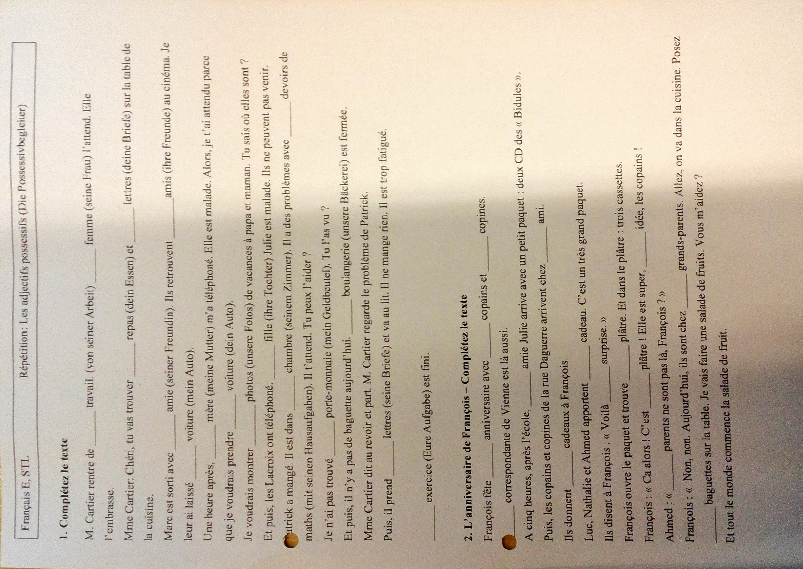

### AB

1. Elle l' appelle 'ami' (Sie nennt ihn Freund )
2.  Zadig lui demande depuis quand il est là. (Zadig fragt ihn, nachdem er da ist)
3. Il lui raconte qu'il veut voyager.
4. Elle l' attend.
5. Elle le plaint.
6. Pierre lui montre le photo.
7. Personne ne l'aide.
8. Il ne répond pas à la question.
9. Les animaux respectent le lion et le flattent.

- J'écoute le prof.
- Tu téléphones au voisin.
- Tu demande quelque chose à ta mère.
- Max donne le livre à Moritz.
- Elle l' accompagne.
- Je te donne mon téléphone.
***
# Regeln

****
# Übungen

