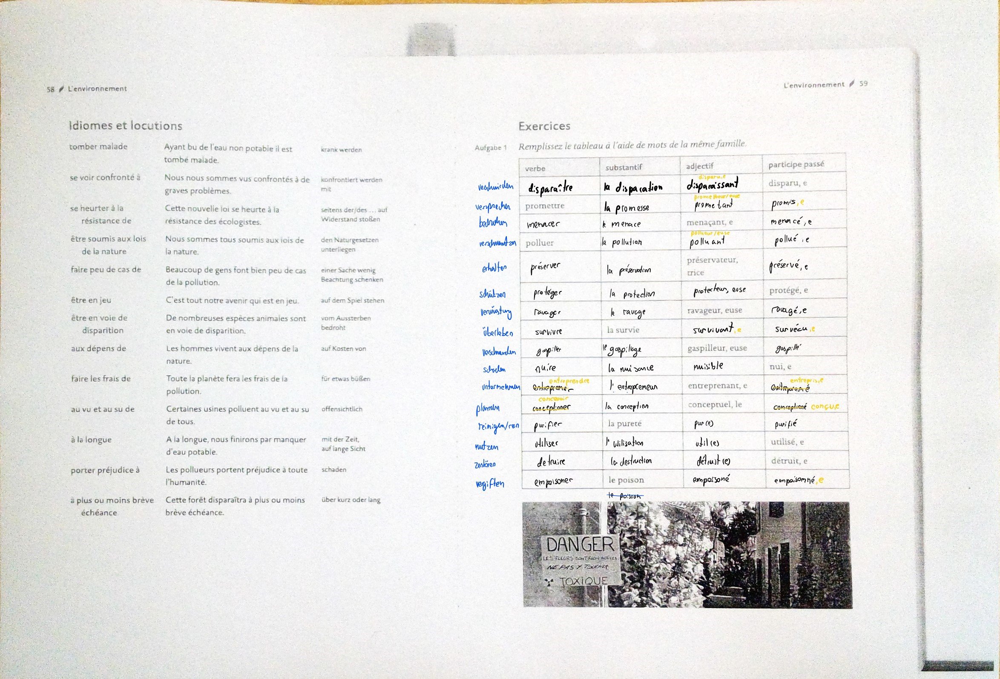
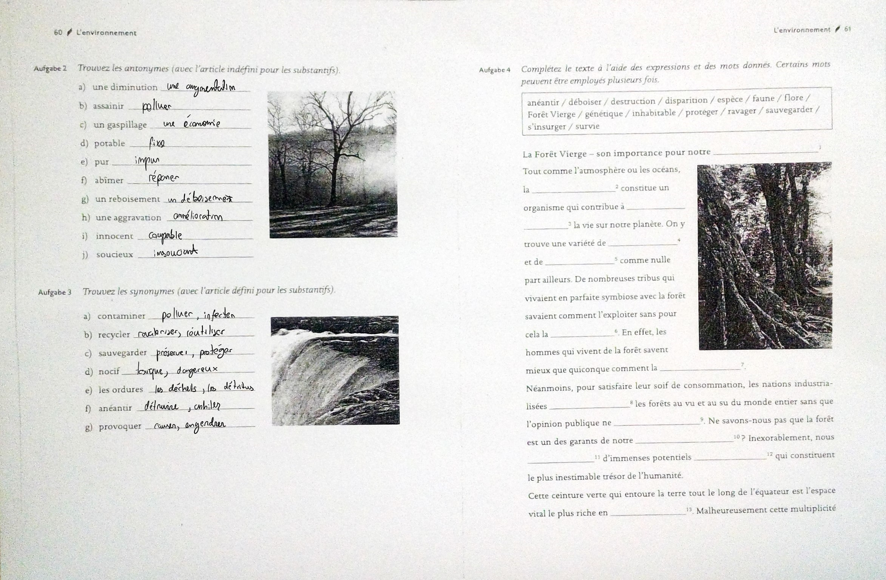
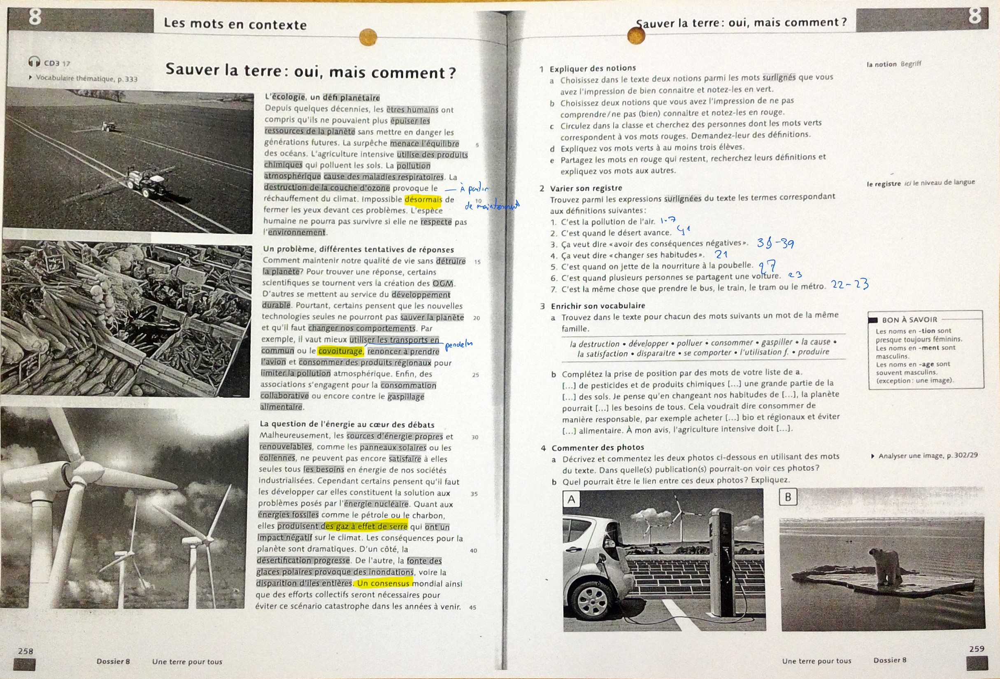

#### Vocabulaire 
[page 1](../../../../docs/images/WIN_20240219_08_58_55_Scan.jpg)
[page 2](../../../../docs/images/WIN_20240219_08_58_48_Scan.jpg)

## Exercises

#### Additional Material

- [ ]  Vokabeln und Ausdrücke im Text lernen + Übungszetteln als Klausurvorbereitung