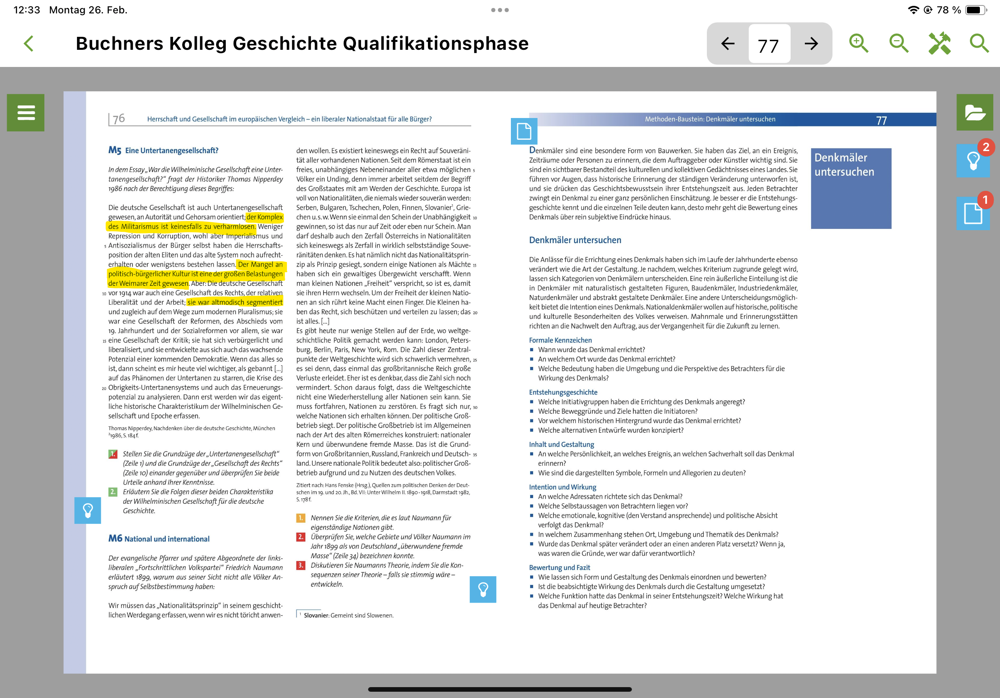

- Im Vergleich zu der Französischen Revolution ist der Mittelstand insgesamt gestiegen. Der bäuerlicher Mittelstand ist größer geworden.
- Arbeiter, Gewerbetreibende, bäuerlicher Unterschichten hat immernoch. 

- [ ] Material auf Iserv abchecken für weitere Informationen

#### Erläutern Sie, inwieweit sich im deutschen Kaiserreich Gesellschaft und Politik im Spannungsfeld zwischen „Tradition und Moderne“ bewegte.

- **Der Adel:** 
	- Sieht sich weiterhin als die von Gott gewollte Führungsschicht und will eine Wirtschaftspolitik, die überwiegend durch den Staat kontrolliert wird und durch Schutzzölle die großen Landgüter von ausländischer Konkurrenz schützt. (protektionistisch)
- **Das Bürgertum:** 
	- Eine heterogene Schicht, die durch die Urbanisierung ideale Aufstiegschancen erhielt, wobei es wichtig zu beachten ist, dass es keine Gleichheit bei diesen Aufstiegschancen gab. Innerhalb dieser heterogenen Masse sind verschiedene Interessen vertreten, dementsprechend kann es auch hier dabei zu Interessenskonflikte innerhalb des Bürgertums geben.
		- *Großbürgertum:*  Verfügen über große Vermögensverhältnisse. Darunter zählen bürgerliche Unternehmer, die sich zwar am Adel als gesellschaftliches Vorbild orientierte, jedoch nach einer Freihandelspolitik strebten, welches Exporte begünstigten.
		- *Bildungsbügertum:* Rechtsanwälte, Lehrer, Ärzte. Durch ihre akademischen Fähigkeiten erhielten sie einflussreiche Positionen im öffentlichem Leben oder in der Verwaltung.
		- *Kleinbürgertum:* Ist vor allem stark durch den Druck der Urbanisierung betroffen, sich an die neuen Umständen im Arbeitsmarkt anzupassen. Vor allem die Handwerker sind davon betroffen, die im Anbetracht der verschwindenen Berufen in dieser Branche, aufgrund von Automatisierung  durch Machinen, gezwungen sind neue Arbeit zu suchen.

- **Die Arbeiterschaft:**
	- Die Arbeiterschaft ist zwar auch eine heterogene Gesellschaftsschicht, die sich unteranderem in ihrer Herkunft, Geschlecht, Ausbildung, Arbeitsplatz unterscheidet, jedoch durch die Tatsache verbunden ist, dass sie gemeinsam häufigerweise in einer Arbeiterfamilie harte Arbeitsbedingungen, niedrigere Löhne, und schlechte Wohnverhältnisse ertragen muss. 
	  
	  Während das Bürgertum von der Mobilität der Gesellschaft profitieren konnte, war dieser Fortschritt bei der Arbeiterschaft nicht zu sehen, unteranderem Aufrgrund der Integrationsbereitschaft durch die Oberschicht. Lediglich der Aufstieg vom einfachen Arbeit zum Vor- oder Facharbeiter war möglich.
	  
- **Traditionell-konservative Bevölkerung:**
	- In den ländlichen Gebieten bildeten sich Bevölkerungsgruppen, die das moderne Leben der Stadt, die *Konsumgesellschaft* tendentiel skeptisch ansahen und ablehnten.
	  
- **Der Wandel insgesamt:**
	- Durch die Verbesserung der Arbeitsumständen und der 
	- Allgemeine Schulpflicht und der Ausbau von Unis
	- Massenkonsum 
	- *Überarbeiten falls notwendig…..*

- [ ] Schicken 

##### Fokus der Arbeit 
- verknüpung Innenpolitik Bismarcks
- sozialisten Gesetze
- mit Industrialisierung und der sozialen Gesetzgebung verknüpfen
- Einordnung
  
  
  
  

#### Nr.1 Stellen Sie die Grunzüge der “Untertanengesellschaft” und die Grundzüge der “Gesellschaft des Rechts” einander gegenüber und überprüfen Sie beide Urteile anhand Ihrer Kenntnisse
