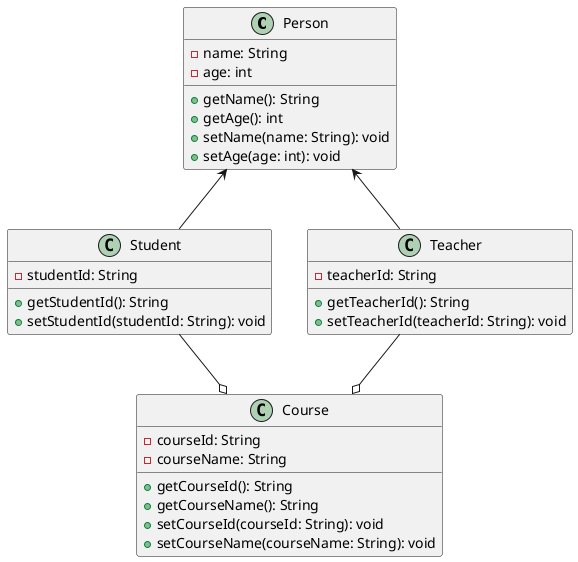
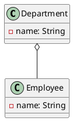
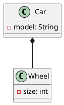
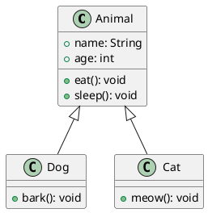
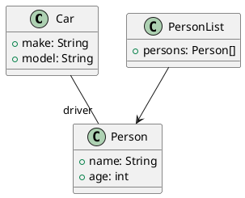

UML steht für *„Unified Modelling Language“* und ist ein Modellierungssystem, welches das Veranschaulichen verschiedenster Dinge standardisiert darstellt.
Besonders in der Informatik bzw. Java können UML-Diagramme nützlich sein, um den Aufbau eines Objekt-Orientierten-Programms zu veranschaulichen. Hierbei fokussieren wir uns besonders auf die sogenannten Klassendiagramme.



## Aufbau

``` plantuml
class Example{
- name: String
# age: int

+ setName()
~ getName()
- setAge()


}
```
Der Aufbau ist relativ simpel. Ganz oben kommt als allererstes der *Klassenname*. Unter dem Klassennamen die *Attribute* dieser Klasse. Dann werden die *Methoden* der Klasse aufgeschrieben. Hierbei ist es wichtig zu wissen, dass man bei der Sichtbarkeit unterscheidet. Attribute und Methoden können `private`, `public`, `protected` oder `default` sein. 

- **Private:** Das Attribut oder die Methode sind nur innerhalb der Ursprungsklasse erreichbar und nicht für andere Klassen. 
- **Public:** Das Attribut oder die Methode sind auch in anderen Klassen zugänglich.
- **Protected:** Eine Mischung aus beiden. Attribute und Methoden sind nur innerhalb der Ursprungsklasse und innerhalb ihrer Subklassen erreichbar, nicht aus anderen Klassen.
- **Default:** Die Standardeinstellungen der Programmiersprache, IDE usw. werden dabei genutzt.

Bei den Methoden der Klasse werden *Methodenattribute* und ihr Datentyp in der Klammer gekennzeichnet. Wenn eine Methode einen *Rückgabewert* besitzt, wird sein entsprechender Datentyp nach den Klammern gekennzeichnet. 

```plantuml
class Example{
- name: String

- setName(methodenattribut: String)
- printName() : String
}

```


## Relationen 

Klassen stehen im unterschiedlichen Verhältnis zueinander, deshalb werden verschiedene Symbole verwendet, um diese Beziehungen innerhalb der Klassen zu repräsentieren.

#### Aggregation:

Eine Aggregation ist ein besonderer Typ von Relation. Wenn eine Klasse einer Oberklasse zugeordnet wird, diese aber auch ohne diese Oberklasse (Container) existieren kann, dann ist eine Aggregation vorhanden. Um eine Aggregation darzustellen, benutze `o--` in PlantUML. Hier ist ein Beispiel für eine Aggregation:



Hierbei besitzt die Klasse `Employee` dem Container `Department` untergeordnet. `Employee` Klassen können teil einer `Department` Klasse sein, können aber auch existieren, wenn die `Department` Klasse nicht mehr existiert.

#### Komposition:

Eine Komposition ist eine stärkere Form der Aggregation. Dabei ist die Unterklasse komplett von seiner Oberklasse abhängig und kann ohne diese nicht existieren. Um eine Kompositionsbeziehung in PlantUML darzustellen, benutze `*--`, gefolgt vom Klassennamen. Hier ist ein Beispiel:



In diesem Beispiel haben wir zwei Klassen: `Car` und `Wheel`. Die Klasse `Car` hat eine Kompositionsbeziehung zur Klasse `Wheel`, dargestellt durch das `*--` Symbol. Dies bedeutet, dass ein `Car` aus genau vier `Wheel`-Instanzen besteht.

#### Vererbung: 

Wie es der Name schon sagt, vererben hierbei die Unterklassen alle Eigenschaften der Oberklasse in dieser Relations-form.



In diesem Beispiel gibt es eine Basisklasse `Animal`. Die Klassen `Dog` und `Cat` erben alle Eigenschaften (alle Attribute und Methoden) von `Animal` und haben jeweils zusätzliche Methoden (`bark()` für `Dog` und `meow()` für `Cat`). Um eine Relation in PlantUML zu schreiben nutze `<|--`, wobei der Pfeil zur Oberklasse zeigen soll.

In Code ist das Schlüsselwort `extend` wir in diesem Beispiel gezeigt

``` Java
public class Dog extends Animal {
...
}
```

#### Assoziation

Hiebei liegt die Beziehung nur in der Interaktion zwischen zwei Klassen. Es ist die einfachste Form der Relation, die einfach nur andeutet, dass die Klassen einfach nur miteinander interagieren in irgendeiner Weise.



In diesem Beispiel gibt es die Klassen `Car` und `Person`. Die Assoziation besagt, dass die Klasse `Car` die Klasse `Person` als `Driver` nimmt und somit mit dieser Klasse etwas zutun hat. Um es in PlantUML zu schreiben nutze `--`, für eine *direktionale* Assoziation nutze `-->`, welches soviel bedeutet wir, “es verwendet von…”.

Im Code erkennt man diese daran, dass es in einer Klasse Attribute gibt, die als Datentyp die assoziierte Klasse verwenden.

